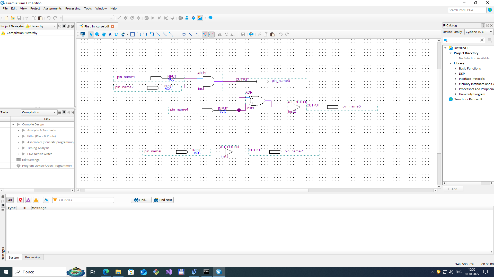

# Learning FPGA 
## Description of works
1.  *(First_in_course and Blink)*. Main goal is to build a simple logic by using primitives as (__and__, __or__, __not__) blocks. 
2.  *(Prime_number)*. Main goal is by using previous blocks create a detector of simple numbers. Map of Karno was done. 
3.  *(Third_les)*. Goal of this work is to create __D-trigger__ by using simple logic primitives. (__RS-trigger__, __D-latch__).
4.  *(Fourth_les)*. Creating a __4-bit summator__ by using Verilog. Testbenches were added.
5.  *(Fifth_les)*. __4-bit counter__ was created that can count up and down. Decoder for seven segments indicator was made. Range_analyzer that can indicate at which level an input number sets.
6.  *(Sixth_les)*. Decoder and counter were combined in this work.
7.  *(Seventh_les)*. __Machine state work was done__. There are some sequence code which must be set without interrupting.

### FIRST IN COURSE and BLINK

   

Managing LEDs by primitives blocks.

### PIME_NUMBER

