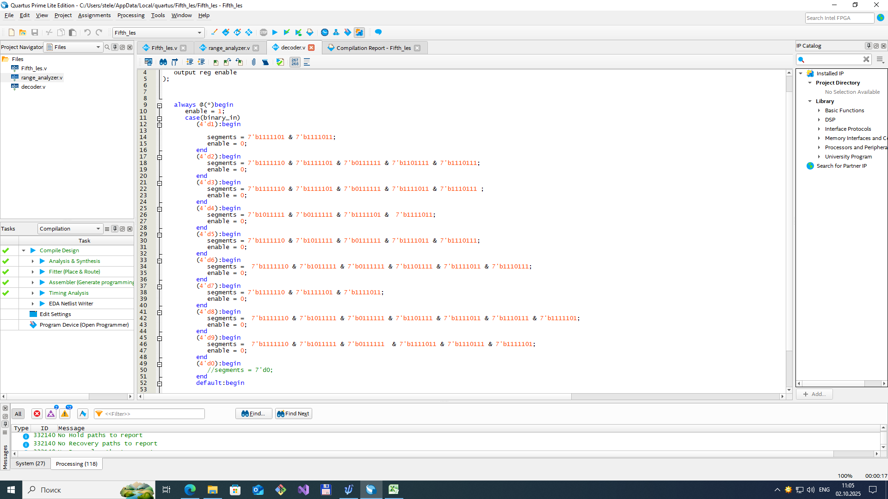
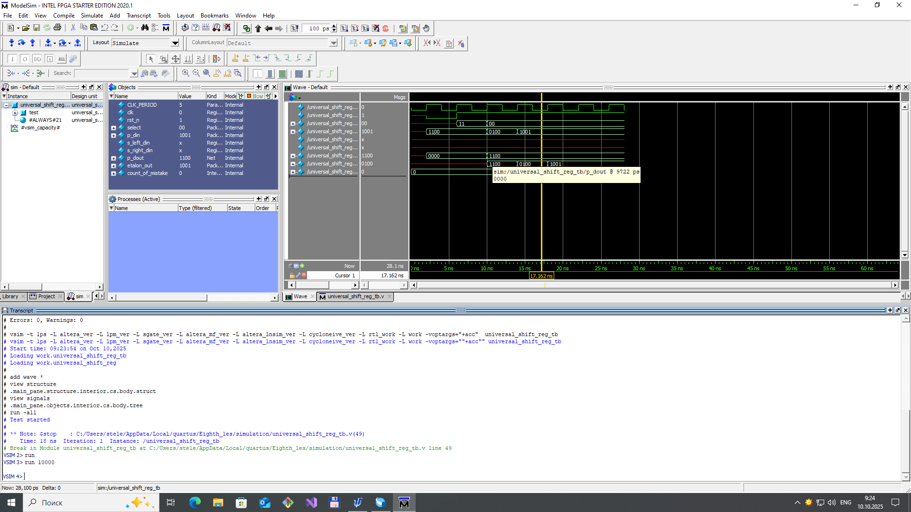

# Learning FPGA 
## Hardware description
Development board __OMDAZZ__ is used in this education curse. FPGA is __Cyclone IV EP4CE6E22__. Board is programmed through __USB Blaster__. More information about board can be found 
here https://habr.com/ru/articles/749298/?ysclid=mgkkxm682a619204809.

## Description of works
1.  *(First_in_course and Blink)*. Main goal is to build a simple logic by using primitives as (__and__, __or__, __not__) blocks. 
2.  *(Prime_number)*. Main goal is by using previous blocks create a detector of simple numbers. Map of Karno was done. 
3.  *(Third_les)*. Goal of this work is to create __D-trigger__ by using simple logic primitives. (__RS-trigger__, __D-latch__).
4.  *(Fourth_les)*. Creating a __4-bit summator__ by using Verilog. Testbenches were added.
5.  *(Fifth_les)*. __4-bit counter__ was created that can count up and down. Decoder for seven segments indicator was made. Range_analyzer that can indicate at which level an input number sets.
6.  *(Sixth_les)*. Decoder and counter were combined in this work.
7.  *(Seventh_les)*. __Machine state work was done__. There are some sequence code which must be set without interrupting. Pulse extender and Button debouncer were made.
8.  *(Eighth_les)*. testbenches for shift register. And shiht register was done.
9.  *(Nineth_les)*. Simulation of ROM memory was made. Program reads data from .hex file and then can address to memory.

### FIRST IN COURSE and BLINK

   

### PRIME NUMBER

### THIRD LES

### FOURTH LES

### FIFTH LES AND SIXTH LES

### SEVENTH LES

### EIGHTH LES

### NINETH LES

